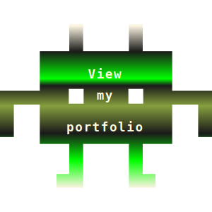

  

$$
{\color{red}🛠\space \space \color{green}Tech Stack\space \space \color{red}🛠}
$$

  
  
  
  
  
  
  
  
  
  
  
  
  
  
  
  
  continuously learning!

I am a full-stack MERN Web Developer with a critical thinking mind-set who prones to problem solving in many aspects of life, design and code development. I have been listening, learning, practicing as well as seeking a new role which leverages my skill set. Now it is time to connect and find out what the future will bring. 

  
  
  
  
  
  
  
  

#### Contact :mailbox:

  <table>
  <tr>
    <td >EN</td>
  </tr>
  <tr>
    <td>DE</td>
  </tr>
  <tr>
    <td>ภาษาไทย</td>
  </tr>
</table>

$$
{\color{red}Made \space \color{red} With \space \color{red}❤️ }
$$
