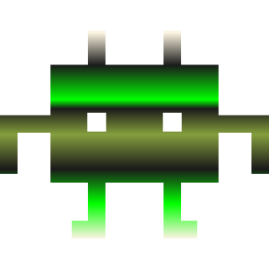
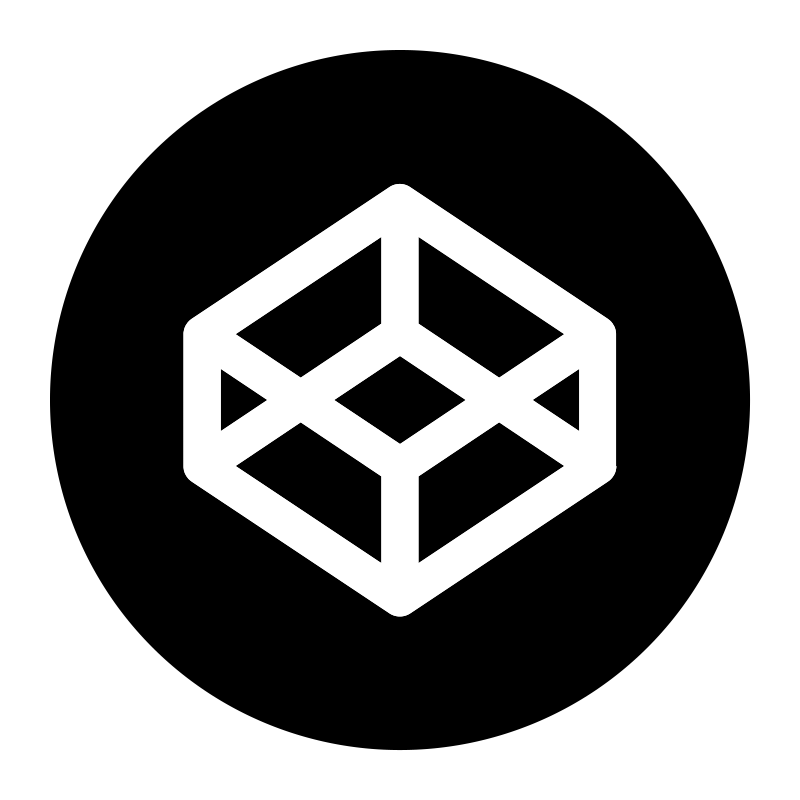
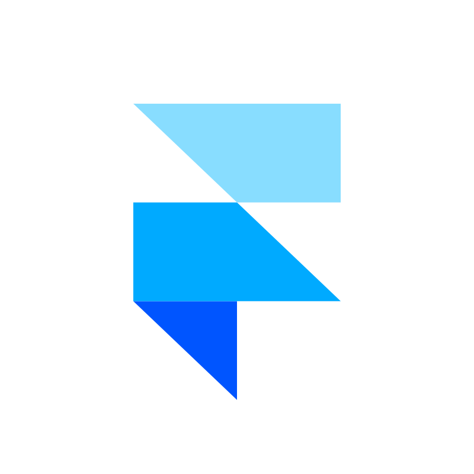
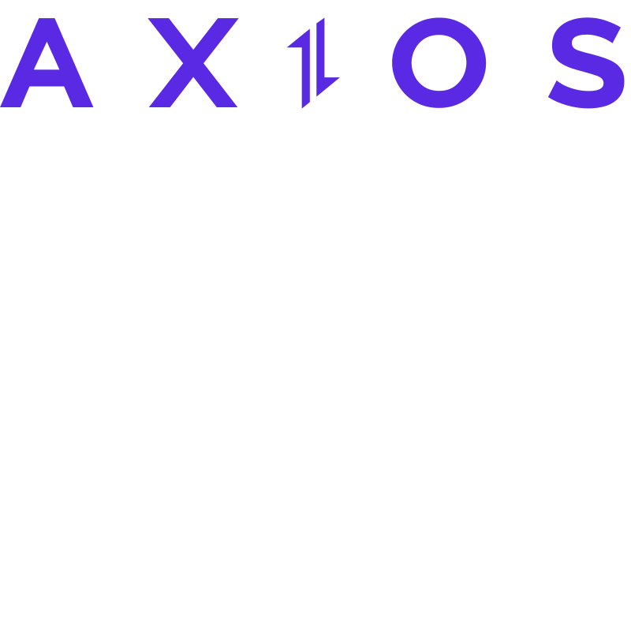
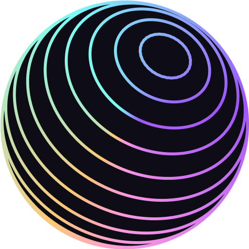

<p align="center">
  <a href="https://dropdeaddev-1.onrender.com" target="_blank" rel="noopener noreferrer">
    
  </a>
</p>

```yaml
name: Tuanthong Vaidyanond

languages: [EN, DE, ภาษาไทย]

location: Nürnberg, Germany

description:
  - Certified full-stack (MERN) web developer with a curious, analytical mindset.
  - Passionate about building intuitive, functional, and scalable web applications.
  - Driven by both aesthetics and problems solving with clean code in thoughtful design.
  - Creating intuitive, human-centered web experiences
  - Blending my diverse background into meaningful digital products
  - continuously learning!

fields_of_interests:
  - Full-Stack Web Development (Node.js, Express, React, MongoDB)
  - RESTful API Design & Backend Architecture - Authentication, NoSQL, Mongoose, MVC
  - UI/UX and Frontend Performance
  - Data Analytics & Visualization
  - App development (PWA / mobile-friendly)

goals:
  - Build 20+ portfolio projects and explore 5+ new technologies yearly.
  - Contribute to open-source projects and collaborate with global dev communities.
  - Create meaningful digital products that improve lives and inspire others.
  - A full-time dev role with a motivated team that shares values of quality & curiosity

current_situation:
  - Looking for an internship or full-time role in web development.
  - Exploring advanced Node.js and MongoDB techniques
  - Practicing secure API design, testing, and clean architecture

hobbies:
  - Art & Design
  - Architecture - LEGO
  - Reading & Writing
  - Coding & Debugging
  - Music Discovery
  - Journaling & Mindfulness

i_am_also:
  - A Human being.
  - Former field journalist, sport & cultural correspondent (Siam Sport syndicate Thailand → UK)
  - Ex chef-cook, creator of "Wirtshauskatze" Nürnberg
  - A proud father of a very curious boy!

life_motto: Slow it down and see what happens!
```

$$
{\color{red}🛠\space \space \color{lightgreen}My \space Tech \space Interest \space \space \color{red}🛠}
$$

<p align="center">

  
  
  
  
  
  
  
  
  
  
  
  
  
  
  
  
  
  <span style="background: linear-gradient(to right, red, yellow, green, cyan, blue, violet);" >continuously learning!</span>
</p>

<p align="center">
  
  
  
  
  
  
  
  <a href="https://github.com/TVATDCI/TVATDCI/graphs/contributors">
  
</a>
</p>
<p align="center" style="background: linear-gradient(to right, red, yellow, green, cyan, blue, violet);">

</p>


#### API Collections

- [NATOURS - 2025 API](https://documenter.getpostman.com/view/44358497/2sB3Hhs2Z5)

#### Contact 🧬

[](https://www.linkedin.com/in/tuanthong-vaidyanond-6789782b2)
[](https://dropdeaddev-1.onrender.com/)
[](mailto:tuanthong.vaidyanond@gmail.com)
[](https://codepen.io/Tuanthong-Vaidyanond)
[](https://www.postman.com/tvatdci)

| Language |
| --- |
| EN |
| DE |
| ภาษาไทย |

[](https://docs.github.com/en/get-started/writing-on-github/getting-started-with-writing-and-formatting-on-github/basic-writing-and-formatting-syntax)

$$
{\color{red}Made \space \color{red} With \space \color{red}❤️ }
$$

### 📘 Latest Blog Posts

<!-- BLOG-POST-LIST:START -->
- [Augmentation ...](https://dev.to/tvatdci/augmentation--9f1)
- [my first post!](https://dev.to/tvatdci/my-first-post-1ib3)
<!-- BLOG-POST-LIST:END -->
